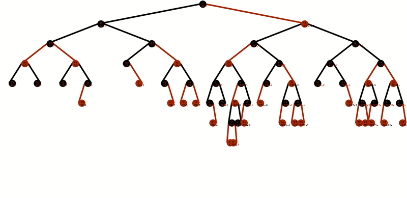
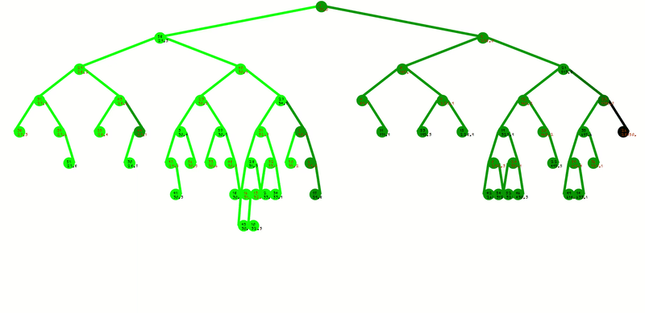
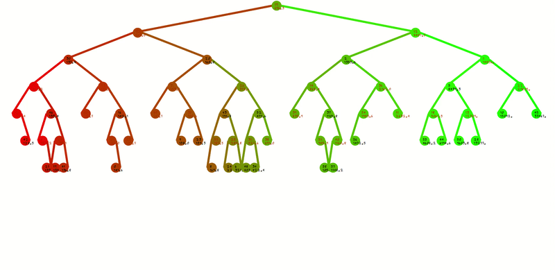

# Linux Completely Fair Scheduler
Danny Kang, Nick Sherman, Nick Steelman
Software Systems

## Goal
Our project goal was to make and visualize a simplified version of the Linux Scheduler. We aimed to accomplish this goal by making a red black tree in C, creating a task simulation environment around it, and visualizing the tree at every step. For questions over terminology or how Red Black trees work, refer to the resources section towards the end.

After prototyping the display, we went back and made the processes created more realistic by getting a set of all processes running on one of our computers at a specific point of time and then simulating them in our environment.

Below are 3 different visualizations of our scheduler as it runs tasks and reinserts them back into the Red Black Tree. In order, they show which nodes are Red or Black, the priorities (highest priority means lightest green), and the virtual time ran (lower vtime means more red). In our sample visualizations, we are not adding processes as the processes are based off a sampling of processes running on one of our computers shortly after completing the different types of visualization.
  

## Learning Goals
Through working on this project, we as a collective had a few main goals, with individual goals varying. All were achieved at the conclusion of the project. These goals are:
- **Understand the C language better**

We understand that we haven’t had an incredibly large amount of time to learn the C language, especially as most of our first in-depth exposure has come from Software Systems. Therefore, this project gave us an opportunity to better understand the language outside of the perspective of problem sets.
- **Practice C programming**

Similar to understanding the C language better, we wanted to practice C programming and the different conventions that differ from other languages we know, especially Java and Python. Through making a nontrivial project from scratch, we are solidified more of the C standards of programming and became more accustomed to coding in C.
- **Understand better how schedulers work**

Something the three of us were curious about was how scheduling works in operating systems, as we know that processes all get different amounts of time to process data and that not all processes actually run simultaneously on the hardware. Therefore, we spent time understanding how schedulers actually work in order to implement one.
- **Understanding how red/black tree algorithm optimizes work done by the CPU**

In understanding schedulers, we learned that the C language implements its scheduler through a red-black tree. Therefore, we needed to expand our knowledge into understanding red/black trees as well. Nick Steelman already was very well acquainted with the topic as a Data Structures and Algorithms instructor who had given the lecture on red/black trees, and he used his knowledge to help the other two better understand red/black trees.
- **Practice Visualization and learn Visualization in C**

The final goal of the project was to practice visualization of software and to learn how to visualize in C. Visualization is run  using GTK and the Cairo library. Before this, none of us had experience in visualization in C, so we performed research in order to figure out how to accomplish what we wanted.

## Implementation
There were three main branches of implementation in the project which were task management, the red/black tree, and visualization.
#### Task Management
We implemented tasks as a struct with variables such as pid, state, priority, and virtual runtime. We created functions to deal with these tasks by generating them, manipulating their properties, and also checking their virtual runtime to make sure that their runtime do not exceed their lifetime. Our main function consists of a for loop that generates initial tasks and while loop that selects them one by one to be run and can generate new tasks. Each time new task gets generated, it is inserted into red-black tree, which sorts the tasks to run the task with the least virtual runtime.

Below is the code of function that generates new task in form of struct. As you can see below, each task is given random priority value. In implementation, this may be reset to a desired distribution such as that of the actual processes on the computer. Also, there is a local variable, Ndistribute, that contains a log normally distributed random number that gets assigned to lifetime of generated task.

```c
struct node* generate_task(int num_tasks, double min_vtime){

  double Ndistribute;
  Ndistribute = exp(generate_Ndistribute_random(MEAN_RUNTIME, STD_RUNTIME));
	printf("Runtime: %lf\n", Ndistribute );

  struct node* new_task = (struct node*)malloc(sizeof(struct node));;
  new_task->pid = num_tasks;
  new_task->state = 0;
  new_task->IO_use = 0;
  new_task->priority = rand()%40-20;
	set_task_color_1(new_task);
  new_task->lifetime = Ndistribute;
  new_task->vtime = min_vtime;
  return new_task;
}
```

#### Red Black Tree
As a base to implement a Red Black Tree, we fixed and adapted some significantly flawed code online that outlined the base structure for a Red Black Tree and (incorrectly) implemented insert. We fixed the insert function as well as created the delete minimum and check valid functions. This way, we can always get the task with the lowest vtime and check that our completed code works. The node structure created for task management was edited slightly in order to work as the red black tree nodes, but the core information was contained in the same way. For more information on Red Black trees refer to the resources section.

#### Visualization
After researching current visualization libraries in C, it was determined the only two relatively good non-deprecated libraries were GTK and Cairo. GTK already breaks down the different functions a fair amount, where the only function that matters when drawing is the do_drawing function. From here, we broke down this function so that it set up the drawing environment, performed the next tree operation, and then drew the tree post-operation. GTK does not play the best with passing parameters around, so we had to create a global variable that always pointed to the root of the red black tree.

Using this node as a start, the entire tree was visualized. The different color schemes implemented were based around node color, vtime, and priority. We implemented them because we wanted to better visualize those three concepts more. In order to change the colorings, a user must edit the MODE constant set in our main.c function. In order to see the tree with red or black nodes, MODE should be 0. If a gradient based on priorities is desired, change MODE to 1. If a gradient based on vtime is desired, MODE should be set to 2.  
The color of a node in MODE 2  is determined by the following equation:  
  
Where V is the vtime of any given task, MIN is the minimum vtime of any task in the tree, and MAX is the maximum vtime of any task in the tree. The constrains p to be between 0 and 1.
The red value of the node is 1-p while the green is p.

#### Putting it Together
One thing that hasn’t been mentioned yet is how interesting it can be to compile when using GTK. A sample line of code from our Makefile which is used to compile the graphics.o object is:
```make
gcc `pkg-config --cflags gtk+-3.0` -c graphics.c -lm `pkg-config --libs gtk+-3.0`
```
As such, we had to be careful that we were always compiling correctly when compiling our code. Overall, we ran into relatively few issues around this as we maintained careful makefile practice.

## Design decisions
- **Do not overscope (too much)**
Our goal was to implement Linux Completely Fair Scheduler from scratch and given the time constraints, we had to scope our project wisely so that we could accomplish creating our minimum viable product in one month. Therefore, we narrowed our scope to implement some core functionalities of Linux CFS, which are red-black tree, workload simulation, and visualization of the red-black tree. If we had more time we could have also implemented CPU vs IO bound processes and various types of interruptions.
- **Workload simulation**
Thanks to Allen, we were guided to implement exponential distribution of arrival time of tasks and log normal distribution of lifetime of tasks. Considering exponentially distributed arrival time, we used random function in C to generate task only under certain probability (¼ in our case) for each loop. For log normal distribution of lifetime of tasks, we made use of a source code found from online that takes mean and standard variation to produce random normally distributed numbers.
- **Visualization**
In deciding what to visualize, we chose the numbers unique to the task that were most readily available to us, i.e. their color, priority, and current vtime. For priority and current vtime we chose to vary the gradient of green and red as those were the easiest to compute (as opposed to a non-primary) and were the easiest to see differences between nodes. We could have done some visualizations around IO use and lifetime, but IO use would require more overscoping and lifetime  likely would not yield any interesting results.

## Resources
Since our project is easily divided into 3 parts, our resources are divided into the same categories:
#### Task Management:
[Guideline to understanding how Linux CFS scheduler works]( https://notes.shichao.io/lkd/ch4/?fbclid=IwAR0h79u-eT3Ghe0TtarSvO1n4iC8OiBi0pY3uxZrgP-FQfZC2ZwdgFu1IxY)  
[Wikipedia page to exponential distribution analysis](https://en.wikipedia.org/wiki/Exponential_distribution)  
[Stackoverflow reference for generating random lognormal distributed numbers](https://stackoverflow.com/questions/9766147/generate-a-random-number-from-log-normal-distribution-in-c-c)  
[Brief documentation about core features of CFS](https://www.kernel.org/doc/Documentation/scheduler/sched-design-CFS.txt)  

#### Red Black Trees:
[Example Code Base](https://gist.github.com/VictorGarritano/5f894be162d39e9bdd5c)  
[Deleting from a Rb Tree](https://www.geeksforgeeks.org/red-black-tree-set-3-delete-2/)  
[Experience as a DSA instructor](https://drive.google.com/open?id=1cR7LyDS0_BXIbnGHiTGZgxVEhrpR0cx722zy0EHlq2Q)

#### Visualization:
[Example of Displaying Text in Cairo](http://zetcode.com/gfx/cairo/cairotext/)
[The Cairo Graphics Documentation](https://www.cairographics.org/)
[The Gnome GTK Functions’ Documentation](https://developer.gnome.org/gtk3/stable/gtk3-General.html#gtk-main)
[The Gnome’s Developer guide to GTK3’s Stable Release](https://developer.gnome.org/gtk3/stable/)  


## Outcome
Overall, our project turned out very well and was at the upper bound or arguably exceeded what we identified in the proposal. As stated in the initial goals, we set out to make a red/black tree, use the red/black tree to keep track of the current processes, and then visualize the tree. We extended the project by learning more about how to best distribute the processes as well as making multiple additional ways to color the tree in the visualization.

When looking back at our learning goals, we realized that we successfully hit all of our individual goals in conjunction with the team goals. More about the learning goals can be read in the learning goals section.

In the end, we are happy with our final deliverable. We met our learning goals, produced a cool project that we can readily demonstrate, and enjoyed our time making it. A longer video of the visualization can be found [here](https://www.youtube.com/watch?v=LHsueVkWUIM).
